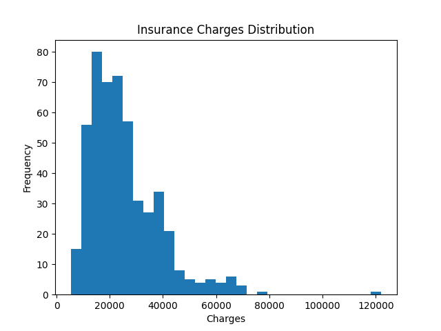

# 🏥 Medical Insurance Cost Prediction


---

## 📌 Project Overview
This project predicts **medical insurance costs** using machine learning techniques based on personal and lifestyle factors like age, BMI, and smoking status.

It helps understand **what drives insurance charges** and builds a predictive model for real-world applications.

---

## 🎯 Objectives
- Analyze factors affecting insurance costs  
- Perform Exploratory Data Analysis (EDA)  
- Build regression models  
- Improve prediction performance  

---

## 📂 Dataset Features

| Feature   | Description |
|----------|------------|
| age      | Age of the individual |
| sex      | Gender |
| bmi      | Body Mass Index |
| children | Number of dependents |
| smoker   | Smoking status |
| region   | Residential region |
| charges  | Insurance cost (Target) |

---

## 🛠️ Tech Stack
- **Python**
- **Pandas, NumPy**
- **Matplotlib, Seaborn**
- **Scikit-learn**

---

## 🔍 Project Workflow

### 📊 1. Data Preprocessing
- Handling categorical variables  
- Checking missing values  
- Feature encoding  

### 📈 2. Exploratory Data Analysis
- Distribution of charges  
- Impact of smoking  
- Correlation heatmaps  

### 🤖 3. Model Building
- Linear Regression  
- Model training & testing  

### 📏 4. Evaluation Metrics
- R² Score  
- MAE  
- MSE  

---

## 📊 Results
- Strong predictors: **Smoking, BMI, Age**  
- Achieved good accuracy using regression model  
- Clear cost difference between smokers vs non-smokers  

---

## 📸 Project Screenshots

### 🔹 Data Distribution


### 🔹 Correlation Heatmap


### 🔹 Model Prediction vs Actual


---

## 🚀 How to Run

```bash
# Clone repo
git clone https://github.com/your-username/medical-insurance-prediction.git

# Move into project folder
cd medical-insurance-prediction

# Install dependencies
pip install -r requirements.txt

# Run notebook
jupyter notebook
